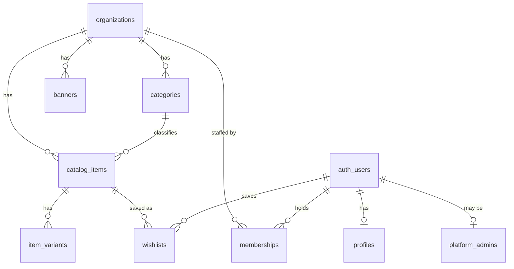

# Data model

This is the schema Phase 2's migrations implement under
`supabase/migrations/`. It exists here as the reviewable design; once the
migrations are written, keep this file in sync with them — it should always
describe the actual schema, not an aspiration.

## Tables

### `organizations`

Operational registry for the three fixed brands. Everything else in the
system is scoped to one of these. Public names, descriptions, logos, contact
details, and social links are static configuration in `lib/site-config.ts`.

| Column | Type | Notes |
|---|---|---|
| `id` | `uuid` pk | `default gen_random_uuid()` |
| `slug` | `text` | unique, url-safe |
| `is_active` | `boolean` | `default true` — gates ALL public visibility of the org's content, not just the org itself |
| `created_at`, `updated_at` | `timestamptz` | |

Writes: platform admin only. The three registry rows are seeded and public
identity is not editable through the application.

### `profiles`

One row per `auth.users` row, created automatically.

| Column | Type | Notes |
|---|---|---|
| `user_id` | `uuid` pk, fk → `auth.users(id)` | `on delete cascade` |
| `display_name` | `text` | nullable |
| `created_at`, `updated_at` | `timestamptz` | |

Created by an **idempotent**, `SECURITY DEFINER` trigger function
(`handle_new_user`) on `auth.users` insert, with a pinned `search_path` —
the canonical Supabase pattern. Idempotent (`on conflict (user_id) do
nothing`) as cheap insurance against the trigger firing more than once for
the same user in edge-case auth flows.

### `platform_admins`

Global admins. Deliberately tiny and separate from `memberships`, because
"can manage everything" and "can manage one org" are different kinds of
grant and conflating them invites subtle policy mistakes.

| Column | Type | Notes |
|---|---|---|
| `user_id` | `uuid` pk, fk → `auth.users(id)` | `on delete cascade` |
| `created_at` | `timestamptz` | |

No client role has any policy on this table at all — see
`docs/RLS_POLICIES.md`. Managed exclusively through
`/api/v1/admin/users` using `lib/supabase/admin.ts`.

### `memberships`

Org-scoped staff assignments.

| Column | Type | Notes |
|---|---|---|
| `id` | `uuid` pk | |
| `user_id` | `uuid`, fk → `auth.users(id)` | `on delete cascade` |
| `organization_id` | `uuid`, fk → `organizations(id)` | `on delete cascade` |
| `role` | `text` | `check (role in ('staff'))` — see note below |
| `created_at` | `timestamptz` | |

Unique on `(user_id, organization_id)`.

> The single-value CHECK on `role` isn't an oversight — `platform_admins` is
> a separate table specifically so "admin" (platform-wide) and "staff"
> (org-scoped) are never confused in one policy. It's written as a CHECK
> rather than hardcoded so a future org-scoped role (e.g. a read-only
> "viewer") can be added without a schema rewrite — don't add one
> speculatively now, this is just why the column isn't simply a boolean.

### `categories`

| Column | Type | Notes |
|---|---|---|
| `id` | `uuid` pk | |
| `organization_id` | `uuid`, fk → `organizations(id)` | `on delete cascade` |
| `name` | `text` | |
| `slug` | `text` | |
| `sort_order` | `int` | `default 0` |
| `is_active` | `boolean` | `default true` |
| `created_at`, `updated_at` | `timestamptz` | |

Unique on `(organization_id, slug)`.

### `catalog_items`

Products and services, treated identically apart from the `type` column.
`price`/`compare_at_price` are **display-only** — see AGENTS.md's "price is
a display field, not a feature" note; neither has stock, quantity, or SKU.

| Column | Type | Notes |
|---|---|---|
| `id` | `uuid` pk | |
| `organization_id` | `uuid`, fk → `organizations(id)` | `on delete cascade` |
| `category_id` | `uuid`, fk → `categories(id)` | `on delete restrict` — see below |
| `type` | `text` | `check (type in ('product','service'))` |
| `title` | `text` | |
| `slug` | `text` | |
| `description` | `text` | nullable |
| `status` | `text` | `check (status in ('draft','published','archived'))`, `default 'draft'` |
| `price` | `numeric(10,2)` | `check (price >= 0)`. BDT, no currency column (single-currency platform) |
| `compare_at_price` | `numeric(10,2)` | nullable, `check (compare_at_price is null or compare_at_price >= price)` — an optional "was" price for a plain was/now display |
| `created_at`, `updated_at` | `timestamptz` | |

Unique on `(organization_id, slug)`. Images are **not** a column here — see
`item_images` below; a product supports a full image gallery, not one photo.

`category_id → categories(id)` uses **`ON DELETE RESTRICT`** (not cascade) —
the brief requires blocking category deletion while any item still
references it. The API layer pre-checks this for a friendly 409/422; the FK
is the actual guarantee.

**Cross-tenant integrity:** a `BEFORE INSERT OR UPDATE` trigger
(`enforce_item_category_same_organization`) raises an exception if the
referenced category's `organization_id` doesn't match the item's own. Chosen
over denormalizing `organization_id` onto a composite FK because a trigger
with an explicit `RAISE EXCEPTION` message is more auditable — a future
reader doesn't have to reverse-engineer *why* a redundant column exists.
`lib/validation/item.schema.ts` duplicates this check at the API layer so a
mismatch returns a clean 422 instead of a raw database error; the trigger is
the non-negotiable guarantee, the Zod check is just the nicer error message.

### `item_variants`

Descriptive attributes only (e.g. `label: "Size", value: "500ml"`) —
never stock, quantity, or price.

| Column | Type | Notes |
|---|---|---|
| `id` | `uuid` pk | |
| `item_id` | `uuid`, fk → `catalog_items(id)` | `on delete cascade` |
| `label` | `text` | |
| `value` | `text` | |
| `sort_order` | `int` | `default 0` |
| `created_at` | `timestamptz` | |

No `organization_id` column — visibility and write access are always
derived by joining back to the parent `catalog_items` row (see
`docs/RLS_POLICIES.md`). Index on `item_id`.

### `item_images`

A product's image gallery — zero or more images per item.

| Column | Type | Notes |
|---|---|---|
| `id` | `uuid` pk | |
| `item_id` | `uuid`, fk → `catalog_items(id)` | `on delete cascade` |
| `image_path` | `text` | |
| `alt_text` | `text` | nullable |
| `sort_order` | `int` | `default 0` |
| `created_at` | `timestamptz` | |

Same shape as `item_variants` in every way that matters: no
`organization_id` column, visibility/write access derived by joining back to
the parent `catalog_items` row. **The lowest `sort_order` is the cover image
by convention** — no separate `is_primary` flag. Index on `item_id`.

### `banners`

| Column | Type | Notes |
|---|---|---|
| `id` | `uuid` pk | |
| `organization_id` | `uuid`, fk → `organizations(id)` | `on delete cascade` |
| `image_path` | `text` | |
| `alt_text` | `text` | required — accessibility |
| `target_url` | `text` | nullable, validated as a safe relative path or same-origin/https URL |
| `sort_order` | `int` | `default 0` |
| `is_active` | `boolean` | `default true` |
| `created_at`, `updated_at` | `timestamptz` | |

### `wishlists`

| Column | Type | Notes |
|---|---|---|
| `user_id` | `uuid`, fk → `auth.users(id)` | `on delete cascade` |
| `item_id` | `uuid`, fk → `catalog_items(id)` | `on delete cascade` |
| `created_at` | `timestamptz` | |

**Composite primary key** `(user_id, item_id)` — this alone is what makes a
duplicate save harmless: the API inserts with `on conflict do nothing`
rather than checking-then-inserting, so a double-click never surfaces an
error.

## Indexes

Beyond what the primary keys and unique constraints already provide:

- `organizations(slug)`
- `categories(organization_id, is_active)`
- `catalog_items(organization_id, status)` — plus a **partial** index
  `catalog_items(organization_id, status) where status = 'published'`,
  since the public catalog's hot read path always filters on exactly that
- `catalog_items(category_id)`
- `item_variants(item_id)`
- `banners(organization_id, is_active)`
- `wishlists(user_id)`

## Helper functions (used by RLS policies)

Both `SECURITY DEFINER`, `STABLE`, with a pinned `search_path` — required so
policies on other tables can check `platform_admins`/`memberships` (which
have no client-readable policies of their own) without triggering RLS
recursion:

- `is_platform_admin(uid uuid) returns boolean`
- `has_org_membership(uid uuid, org_id uuid) returns boolean`

## Seed data (`supabase/seed.sql`, Phase 2)

The 3 named organizations, sample categories/items/banners within the
brief's stated allowance (8 categories / 20 items / 6 banners combined —
soft guidance, not an enforced limit), and 5 known test identities for the
Playwright and RLS policy suites: 2 customers, 1 platform admin, and one
staff account each for two different organizations (to exercise cross-org
isolation tests).
